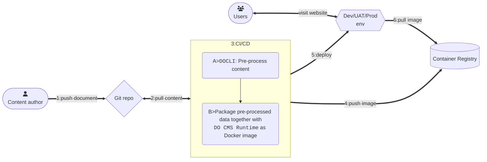

Working with DO CMS is similar to a developer's daily tasks: documents are written in [Markdown](https://www.markdownguide.org/) and then pushed to a Git repository to trigger CI/CD pipelines. The CI/CD pipeline firstly invokes `DOCLI` tool to pre-process the website's content, and then containerizes the pre-processed content together with the `DO CMS runtime` as a Docker image. Finally, the package can be deployed as a website to end users.

The flow is summarized as the diagram:

See more:
- [DOCLI tool](../../components/cli/)
- [DO CMS runtime](../../components/runtime/)
- [Supported Markdown syntax](../../reference/markdown/)
