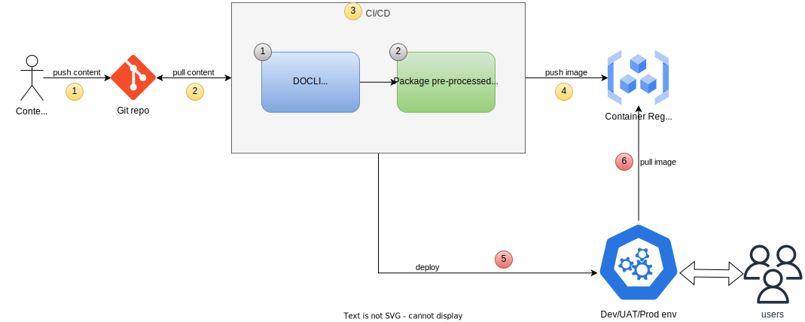

Làm việc với DO CMS tương tự như công việc hàng ngày của một lập trình viên: các tài liệu được viết bằng [Markdown](https://www.markdownguide.org/) và sau đó được push lên Git server để kích hoạt qui trình CI/CD. Qui trình CI/CD trước tiên gọi công cụ `DOCLI` để tiền xử lý nội dung trang web, sau đó đóng gói nội dung đã được tiền xử lý cùng với `DO CMS runtime` thành một Docker image. Cuối cùng, nguyên bộ có thể được triển khai như một trang web đến người dùng cuối.

Toàn bộ qui trình được tóm tắt trong sơ đồ sau:

Xem thêm:
- [Công cụ DOCLI](../../components/cli/)
- [DO CMS runtime](../../components/runtime/)
- [Các cú pháp Markdown được hỗ trợ](../../reference/markdown/)
