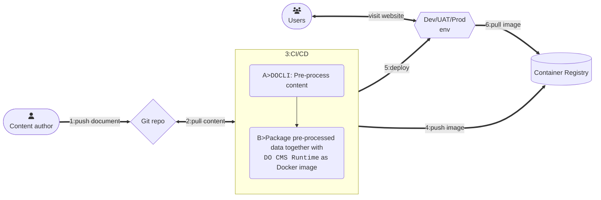

DO CMS supports [GitHub Flavored Markdown](https://github.github.com/gfm/), or often shortened as GFM, with [Bootstrap](https://getbootstrap.com/docs/5.0/) style.

Some notable Markdown features supported by Do CMS are as the following:

## Tables

|col-1|col-2|
|---|---|
|row1 - content1|row1 - content2|
|row2 - content1|row2 - content2|
|row3 - content1|row3 - content2|

## Block quotes

> Block quotes feature is supported, stylist.

## Task list items

- [x] Task 1 is done
  - [ ] Nested task is not done
  - [x] Another nested task, which is done
- [ ] Another task

## Strikethrough

This text is ~~strikethrough~~.

> Even ~~inside a block quote~~.

## Code highlighting

Inline code spans with single backstick (\`) , for example `javascript let i = 0`, as well as double backsticks (\``), for example ``for (i := 0; i < 10; i++)``, are supported.

Code blocks with three backsticks (```) are highlighted:

```cpp
// most common programming are supported
#include <iostream>

int main() {
    std::cout << "Hello World!";
    return 0;
}
```

## Mathematical and Chemical formulas

DO CMS supports Mathematical and Chemical formulas using [KaTeX](https://katex.org/docs/support_table.html) and [mhchem](https://mhchem.github.io/MathJax-mhchem/).

Inline Mathematical formulas are enclosed between two single-dollar signs (`$`): $x^2 + y^2 = z^2$

Block Mathematical formulas are simply `code` blocks with language `katex`:
```katex
\begin{equation}
\begin{split}
(a - b)^2 &= (a - b)(a - b) \\
&= a(a - b) - b(a - b)      \\
&= a^2 -ab -ba + b^2        \\
&= a^2 + 2ab + b^2          \nonumber
\end{split}
\end{equation}
```

Similar syntax for inline Chemical formulas: $\ce{CO2 + C -> 2 CO}$

and block Chemical formulas:
```katex
C_p[\ce{H2O(l)}] = \pu{75.3 J // mol K}
```

## Diagrams

Use [mermaid syntax](https://mermaid.js.org/intro/) to draw diagrams:



```bs-alert success

See detailed supported Markdown syntax [here](../../reference/markdown/).
```
