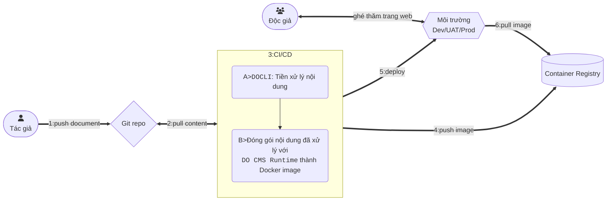

DO CMS hỗ trợ [GitHub Flavored Markdown](https://github.github.com/gfm/) (viết tắt GFM), cùng với phong cách [Bootstrap](https://getbootstrap.com/docs/5.0/).

Một số tính năng Markdown đáng chú ý được DO CMS hỗ trợ:

## Tables

|cột-1|cột-2|
|---|---|
|dòng1 - ô1|dòng1 - ô2|
|dòng2 - ô1|dòng2 - ô2|
|dòng3 - ô1|dòng3 - ô2|

## Block quotes

> Tính năng trích dẫn khối được hỗ trợ như thế này.

## Task list items

- [x] Nhiệm vụ 1: hoàn thành
  - [ ] Nhiệm vụ con: chưa hoàn thành
  - [x] Một nhiệm vụ con khác, hoàn thành
- [ ] Một nhiệm vụ khác nữa

## Strikethrough

Đoạn văn bản sau ~~được gạch ngang~~.

> Hỗ trợ ~~bên trong một khối trích dẫn~~.

## Code highlighting

Hỗ trợ các đoạn code nhúng giữa 1 dấu nháy ngược (\`) , ví dụ `let i = 0` và 2 dấu nháy ngược (\``), ví dụ ``for (i := 0; i < 10; i++)``.

Các khối code nằm giữa 3 dấu nháy ngược (```) được "tô màu":

```cpp
// hỗ trợ các ngôn ngữ lập trình thông dụng
#include <iostream>

int main() {
    std::cout << "Hello World!";
    return 0;
}
```

## Mathematical and Chemical formulas

DO CMS sử dụng thư viện [KaTeX](https://katex.org/docs/support_table.html) và [mhchem](https://mhchem.github.io/MathJax-mhchem/) để hỗ trợ hiển thị các công thức Toán học và Hoá học.

Các công thức Toán học nhúng được đặt giữa 2 dấu đô-la-đơn (`$`): $x^2 + y^2 = z^2$

Các khối công thức Toán học đơn giản là các khối `code` với ngôn ngữ là `katex`:
```katex
\begin{equation}
\begin{split}
(a - b)^2 &= (a - b)(a - b) \\
&= a(a - b) - b(a - b)      \\
&= a^2 -ab -ba + b^2        \\
&= a^2 + 2ab + b^2          \nonumber
\end{split}
\end{equation}
```

Tương tự cho các công thức Hoá học nhúng: $\ce{CO2 + C -> 2 CO}$

và khối công thức Hoá học:
```katex
C_p[\ce{H2O(l)}] = \pu{75.3 J // mol K}
```

## Biểu đồ

Sử dụng [cú pháp](https://mermaid.js.org/intro/) để vẽ các biểu đồ:



```bs-alert success

Xem danh sách các cú pháp Markdown được hỗ trợ [ở đây](../../reference/markdown/).
```
