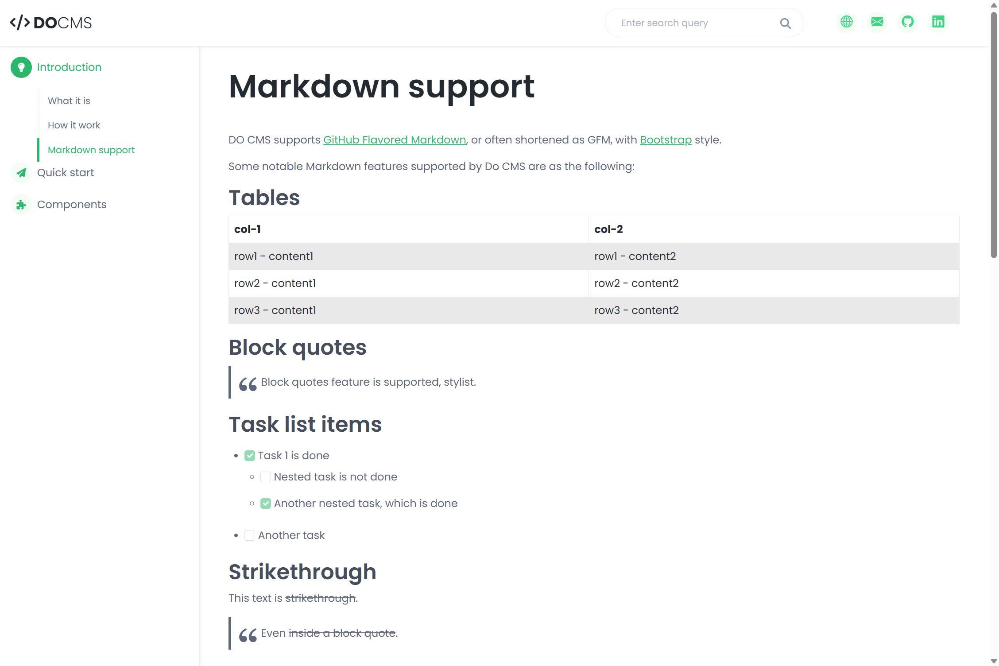

`DO CMS runtime` chịu trách nhiệm thể hiện nội dung trang web, và hỗ trợ một số tính năng khác như i18n hoặc tìm kiếm toàn văn (fulltext search).

Để tiện sử dụng, `DO CMS runtime` đã được đóng gói sẵn thành [Docker image](https://hub.docker.com/r/btnguyen2k/docmsruntime).

Câu lệnh sau sẽ chạy một bản `DO CMS runtime` từ Docker image:

```shell
docker run --name docms \
    -p 8000:8000 \
    -v /path/to/my/dodata:/app/dodata \
    btnguyen2k/docmsruntime
```

## Biến môi trường

**HTTP_LISTEN_ADDR** và **HTTP_LISTEN_PORT** - chỉ định địa chỉ & cổng lắng nghe. Giá trị mặc định của HTTP_LISTEN_ADDR là `0.0.0.0` và HTTP_LISTEN_PORT là `8000`. Câu lệnh sau chi định `DO CMS runtime` lắng nghe `127.0.0.1:3000`:
```shell
docker run --name docms \
    -p 8000:3000 \
    -v /path/to/my/dodata:/app/dodata \
    -e HTTP_LISTEN_ADDR=127.0.0.1 -e HTTP_LISTEN_PORT=3000 \
    btnguyen2k/docmsruntime
```

**DOCMS_DATA_DIR** - chỉ định thư mục gốc chứa nội dung trang web. Giá trị mặc định là `./dodata`. Câu lệnh sau chỉ định `DO CMS runtime` tải nội dung trang web từ thư mục `/mydata`:
```shell
docker run --name docms \
    -p 8000:8000 \
    -v /path/to/my/dodata:/mydata \
    -e DOCMS_DATA_DIR=/mydata \
    btnguyen2k/docmsruntime
```

**FRONTEND_TEMPLATE** - chỉ định giao diện đồ hoạ cho phần thể hiện nội dung trang web. Hiện tại có 3 giao diện có thể lựa chọn là `bootstrap` (mặc định), `coderdocs` and `prettydocs`. Câu lệnh sau sẽ chỉ định `coderdocs` làm giao diện thể hiện:
```shell
docker run --name docms \
    -p 8000:8000 \
    -e FRONTEND_TEMPLATE=coderdocs \
    btnguyen2k/docmsruntime
```

Giao diện **Bootstrap**:

<div class="row row-cols-1 row-cols-md-3">
    <div class="col pb-2">
        <div class="card">
            <h5 class="card-header">Trang nhà</h5>
            <div class="card-body">
                <a href="bootstrap1.png" target="_blank"></a>
            </div>
        </div>
    </div><!-- col -->
    <div class="col pb-2">
        <div class="card">
            <h5 class="card-header">Trang chủ đề</h5>
            <div class="card-body">
                <a href="bootstrap2.png" target="_blank"></a>
            </div>
        </div>
    </div><!-- col -->
    <div class="col pb-2">
        <div class="card">
            <h5 class="card-header">Trang bài viết</h5>
            <div class="card-body">
                <a href="bootstrap3.png" target="_blank"></a>
            </div>
        </div>
    </div><!-- col -->
</div>

Giao diện **CoderDocs**:

<div class="row row-cols-1 row-cols-md-3">
    <div class="col pb-2">
        <div class="card">
            <h5 class="card-header">Trang nhà</h5>
            <div class="card-body">
                <a href="coderdocs1.png" target="_blank"></a>
            </div>
        </div>
    </div><!-- col -->
    <div class="col pb-2">
        <div class="card">
            <h5 class="card-header">Trang chủ đề</h5>
            <div class="card-body">
                <a href="coderdocs2.png" target="_blank"></a>
            </div>
        </div>
    </div><!-- col -->
    <div class="col pb-2">
        <div class="card">
            <h5 class="card-header">Trang bài viết</h5>
            <div class="card-body">
                <a href="coderdocs3.png" target="_blank"></a>
            </div>
        </div>
    </div><!-- col -->
</div>

Giao diện **PrettyDocs**:

<div class="row row-cols-1 row-cols-md-3">
    <div class="col pb-2">
        <div class="card">
            <h5 class="card-header">Trang nhà</h5>
            <div class="card-body">
                <a href="prettydocs1.png" target="_blank"></a>
            </div>
        </div>
    </div><!-- col -->
    <div class="col pb-2">
        <div class="card">
            <h5 class="card-header">Trang chủ đề</h5>
            <div class="card-body">
                <a href="prettydocs2.png" target="_blank"></a>
            </div>
        </div>
    </div><!-- col -->
    <div class="col pb-2">
        <div class="card">
            <h5 class="card-header">Trang bài viết</h5>
            <div class="card-body">
                <a href="prettydocs3.png" target="_blank"></a>
            </div>
        </div>
    </div><!-- col -->
</div>
